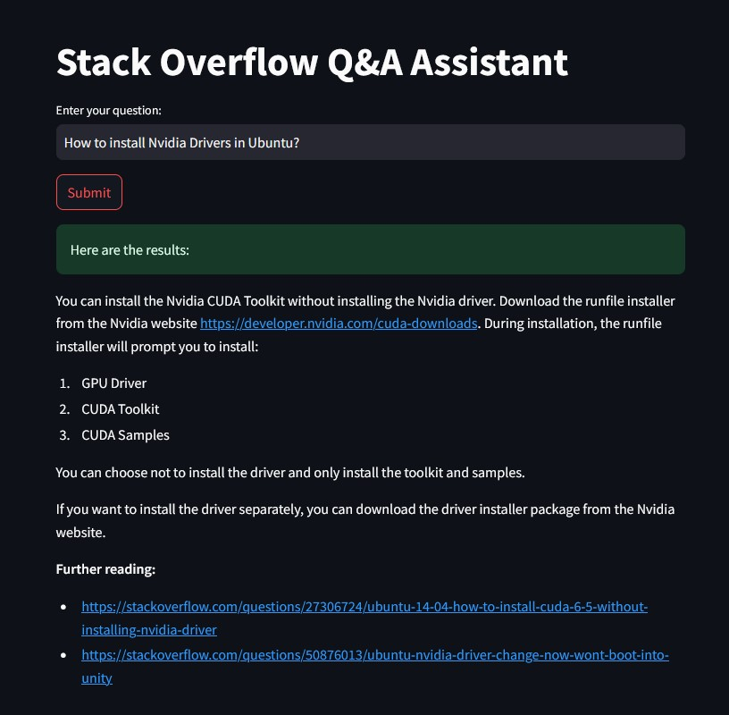
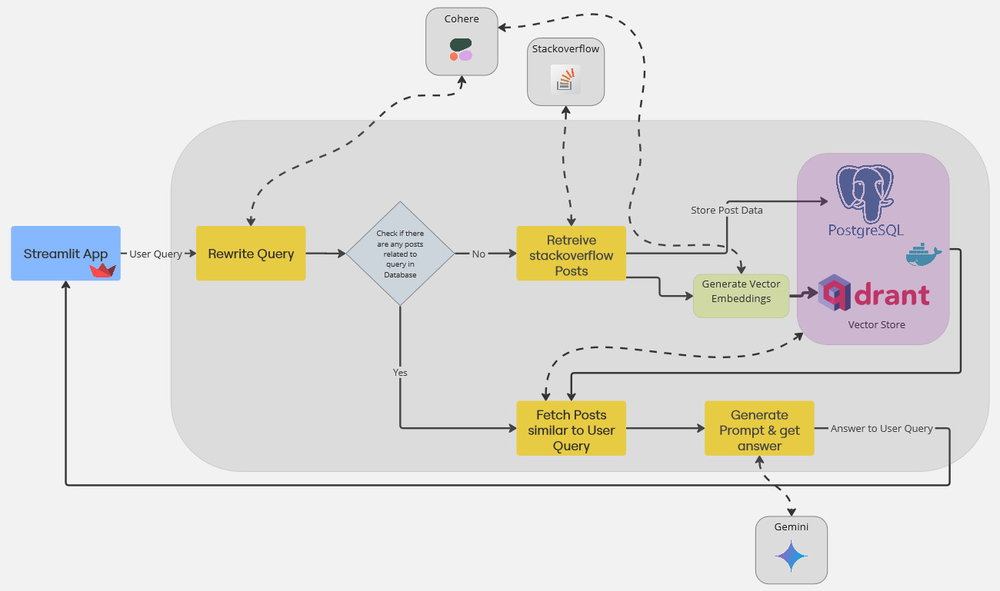

# Stackoverflow QA Assistant using GenAI
This project implements a Generative AI (GenAI) workflow using **Langchain** to create a seamless pipeline for retrieving answers to user queries. It leverages large language models (LLMs) to generate vector embeddings, which are then used for vector-based search to find similar data. The workflow dynamically generates prompts to provide accurate responses. The user interface is built with **Streamlit**, while **Qdrant** serves as the vector storage and **Postgres** as the relational database, both running in **Docker** containers. The project also integrates **Cohere** and **Gemini** as the LLMs to power the AI-driven search and response generation.

<p align="center">
  <br>
</p>


# 🛠️ Technologies Used
- **Streamlit**: Frontend interface for user interactions.
- **langchain**: Connects LLMs for vector embedding, prompt generation.
- **beautifulsoup4**: To scrape and parse web data, helping to retrieve related Stack Overflow posts.
- **sqlalchemy**: For ORM (Object Relational Mapper) to interact with the Postgres database, allowing easy data retrieval, storage and managment.
- **Conda**: Used to manage the project’s virtual environment and dependencies.

## 🫕 Project Overview

<p align="center">
	
</p>

### 🚀 How to Run the Project

1. **Create Conda Environment and Install Dependencies**

   ```bash
   conda create -n ENV_NAME python=3.11 -y
	 conda activate ENV_NAME
	 pip install -r requirements.txt

2. **Setting up Qdrant Collection**
    ```bash
    make create_collection
    ```
    
4. **Starting Streamlit App**
   ```bash
   streamlit run src/index.py
   ```
